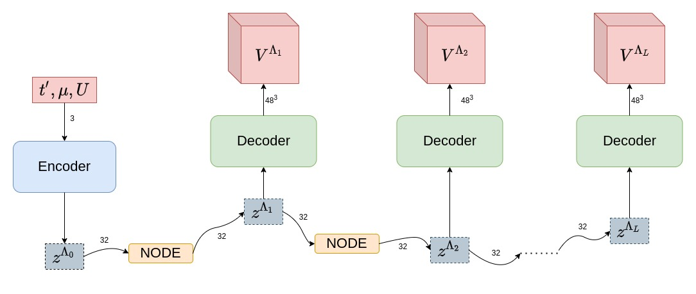

# NeuralFRG

This repository contains contains code for training Parametrized Neural Ordinary Differential Equations (PNODEs) on Functional Renormalization Group (fRG) data.

This code was used to obtain the results in the following paper: **Deep Learning the Functional Renormalization Group**

* Journal link: [PhysRevLett.129.136402](https://journals.aps.org/prl/abstract/10.1103/PhysRevLett.129.136402)
* arXiv link: [arXiv:2202.13268](https://arxiv.org/abs/2202.13268).

Code author: Matija Medvidović (Matematija)

## Installation

To install, simply clone the repository and run:
```shell
cd NeuralFRG # Or the full path to the repo folder
pip3 install .
```

If the installation is succesful, you should be able to import the library:
```python
import neuralfrg as nfrg
```

## Usage

Only a handful of canned models and utility functions are exported. In this section we describe the most relevant subset.

### Models

<center>
    
</center>

The PNODE architecture is well-suited for high-dimensional data. It uses an encoder-decoder architecture to compress the dynamics into (hopefully) a small number of effective relevant variables. `NeuralFRG` exports three predefined models: `Encoder`, `NODE` and `Decoder`. Their behavior defaults to the architecture used in the paper but it is customizable if you want to experiment. For instance, if we set

```python

in_dim = 3
latent_dim = 4
out_dims = (16,16,16)
ode_method = 'dopri5'

encoder_layer_sizes = [8, 64, 128]
node_layer_sizes = [256, 256]
decoder_dense_layer_sizes = [128, 64]
decoder_conv_layer_sizes = [
    (64, 16, 5, 1),
    (16,  8, 3, 1),
    ( 8,  1, 3, 1)
]
# The format here is
# (in_channels, out_channels, kernel_size, stride)
# for transposed convolutions
```
the models can be constructed with

```python

from neuralfrg.models import Encoder, NODE, Decoder

encoder = Encoder(dim=in_dim, ldim=latent_dim, layer_sizes=encoder_layer_sizes)
kernel = NODE(ldim=latent_dim, ode_method=ode_method, layer_sizes=node_layer_sizes)
decoder = Decoder(
    in_dim=latent_dim,
    out_dims=out_dims,
    dense_layer_sizes=decoder_dense_layer_sizes,
    conv_layer_sizes=decoder_conv_layer_sizes,
    final_upsample=True
)
```

or simply with 

```python
from neuralfrg.models import PNODE

pnode = nfrg.PNODE(
    in_dim=in_dim, ldim=latent_dim, out_dims=out_dims,
    encoder_layer_sizes=encoder_layer_sizes,
    node_layer_sizes=node_layer_sizes,
    decoder_dense_layer_sizes=decoder_dense_layer_sizes,
    decoder_conv_layer_sizes=decoder_conv_layer_sizes
)
```

after which each component can be accessed with `pnode.encoder`, `pnode.node` or `pnode.decoder`. Or, the entire PNODE model can be evaluated in one go:

```python
predictions = PNODE(x0, t)
```

where the shape of `x0` is `(batch_size, in_dim)`, shape of `t` is `(n_times,)`. The output `predictions` will then have the shape `(batch_size, n_times, *out_dims)`, representing predicitions for each initial contition at all later times.

### Utility functions

This is an overview of the utility functions. For a more detailed description, see the source code.

* `masked_mse`: Computes the mean squared error between two tensors, ignoring the entries where the mask is zero. Useful for computing the loss of a batch with uneven trajectory lengths.
* `normalize_data`: Given an input tesnor of shape `(batch_size, n_times, ...)`, returns a tensor of the same where each trajectory entry is divided by the maximum absolute value (with respect to a mask) of the corresponding trajectory.
* `count_params`: Counts the number of parameters in a model.
* `checkpoint`: Saves a model to a checkpoint file.
* `load_checkpoint`: Loads a model from a checkpoint file.

### Scripts

The `scripts` folder contains Python scripts the authors used for data preprocessing and training. Both scripts have the `--help` flag enabled which should (hopefully) make their usage simple.

One caveat is the input file format. A `.h5` file is expected to contain following datasets:

* `vertices`: A tensor of shape `(n_trajectories, n_times, *out_dim)` containing the values of the vertices.
* `times`: A tensor of shape `(n_times,)` containing the times at which the vertices were sampled.
* `mask`: A tensor of shape `(n_trajectories, n_times)` containing a binary mask indicating which vertices are valid for each trajectory.
* `couplings`: A tensor of shape `(n_trajectories, in_dim)` containing inital conditions (couplings) for each trajectory.

A train-test split can be performed with

```shell
python3 train_validation_split.py path/to/file.h5 --verbose
```
and training can be started with

```shell
python3 train.py path/to/file_train.h5 (...) #Additional flags here
```

## The BITMAP project

This repository is part of the BITMAP project funded by the European Union’s Horizon 2020 research and innovation programme
under the Marie Sklodowska-Curie Grant Agreement No. 897276.